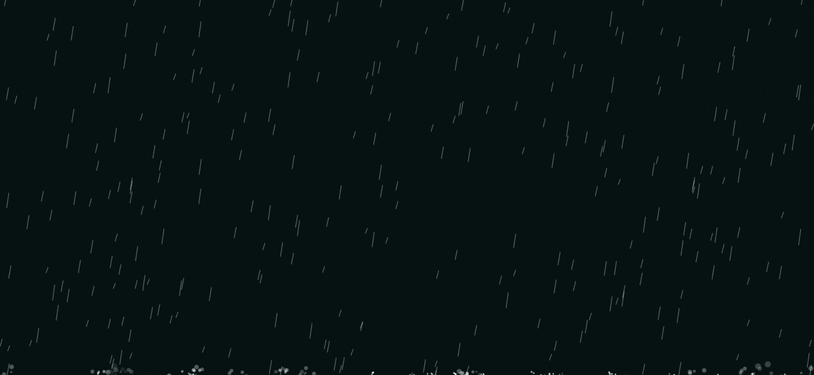
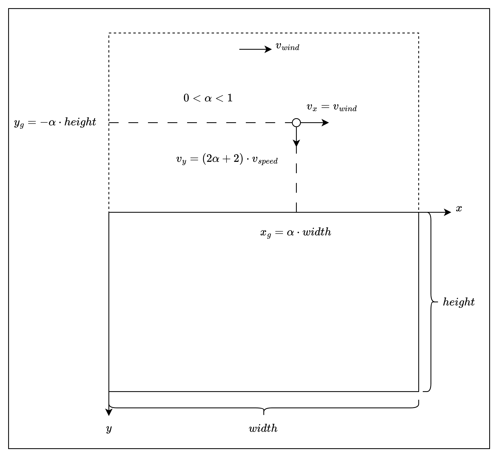
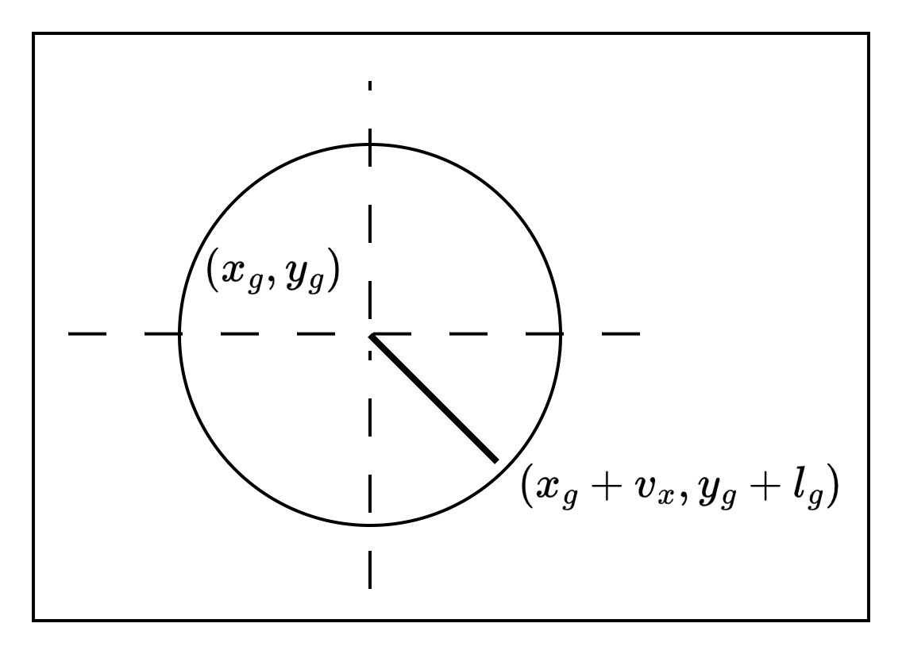
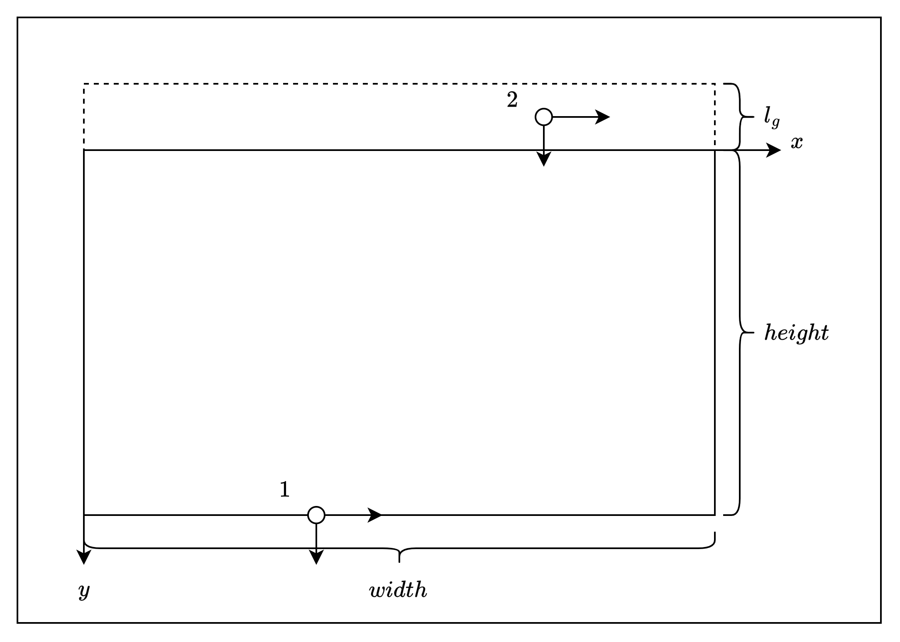
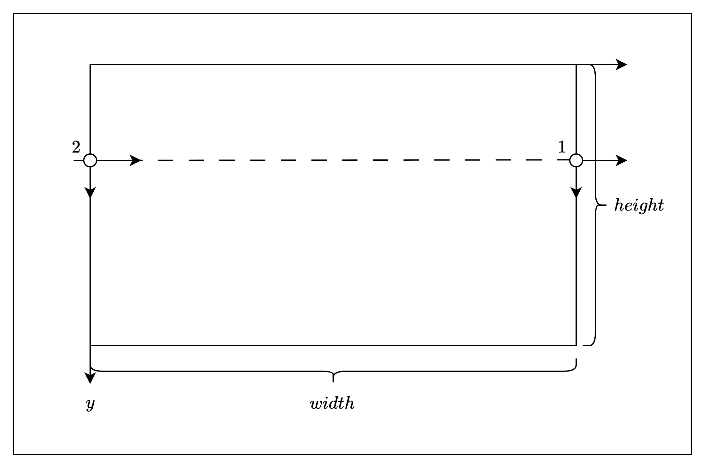

# Estudando Efeito de Chuva Rainify

Essa é a explicação do funcionamento do efeito de chuva desenvolvido `thiagotnon`. Eu analisei o projeto completo dele e reproduzi em uma versão simplificada, a fim de entender cada parte.

O componente que o `thiagotnon` criou se encontra nesse link: [Rainify](https://rainify.thiagonatan.dev.br/).

O repositório de testes que fiz para entendimento a fundo do que acontece se encontra aqui: [rainify-studing-logic](). Existem apenas arquivos `html`, `css` e `javasccript`, por simplificação.

## Elementos Principais

Antes de ir para o código é importante entender o que é necessário fazer para que o efeito de chuva ocorra.

Primeiro, para simular a chuva é necessário ter duas entidades: a gota (`drop`) e o repingo (`splash`). A animação das gotas de chuva irá ocorrer sempre no meio da tela e os respingos irão ser animados sempre que as gotas chegarem na posição mais baixa da tela.

Os atributos que constituem uma gota são:

- `x`: Posição horizontalmente da gota 
- `y`: Posição verticalmente da gota 
- `length`: Comprimento da gota
- `velocityX`: Velocidade no eixo horizontal
- `velocityY`: Velocidade no eixo vertical

Com isso, uma gota nada mais é do que uma linhas com uma posição e velocidade na tela.

Já os atributos que constituem um respingo são:

- `x`: Posição horizontalmente do respingo
- `y`: Posição verticalmente do respingo
- `r`*: Raio do respingo
- `opacity`*: Opacidade do respingo
- `angle`*: Ângulo do respingo
- `velocity`*: Velocidade de crescimento do respingo

Você deve ter ficado um pouco confuso nessa parte, pois um respingo com raio, opacidate, ângulo e velocidade. `O que cada uma dessas coisas significa?`

Bom, o que acontece é que a simulação do respingo é feita como uma círculo de raio `r` que cresce a uma taxa igual a `velocity` definida. Além disso, o efeito de desaparecimento do respingo ocorre por causa da opacidade. Além disso, quando uma gota de chuva chega ao solo, são criados 5 objetos respingos em ângulos diferentes. Se você visitar o site [https://rainify.thiagonatan.dev.br/](https://rainify.thiagonatan.dev.br/) e colocar o parâmetro `splash` igual a 50, você vai notar exatamente esse efeito:


Sabendo desses elementos, agora é necessário saber quais as funções necessarias para montar o efeito da chuva.

Bom, é necessário criar a gota e o respingo. Depois fazer o update das posições de cada um deles, para obter o efeito de animação. Por fim, juntar tudo em algum lugar a animar tudo de uma vez.

É isso que vamos entender daqui para frente agora com o código.

## Implementação (Código)

### Estrutura (`HTML` e `CSS`)

Estruturei meu projeto em um projeto `html`, `css` e `js`.

```bash
.
├── index.html
├── index.css
└── index.js
```

No `html` eu coloquei os links para o `css` e o `js` e a tag canvas.

```html
<!DOCTYPE html>
<html lang="en">

<head>
    <meta charset="UTF-8">
    <meta name="viewport" content="width=device-width, initial-scale=1.0">
    <title>Rainify Studing Logic</title>

    <link rel="stylesheet" href="index.css">
</head>

<body>
    <canvas id="rain"></canvas>

    <script src="index.js"></script>
</body>

</html>
```

No `css`, fiz umas estilizações básicas e coloquei o canvas para ocupar todo o tamanho da tela.

```css
:root {
    --bg-color: hsl(189 50% 5%);
}

*{
    margin: 0;
    padding: 0;
    box-sizing: border-box;
}

body {
    background-color: var(--bg-color);
}

canvas {
    position: fixed;
    bottom: 0;
    left: 0;
    z-index: 0;
    pointer-events: none;
}
```

### Implementação (`JS`)

Agora no arquivo `js`, eu comecei colocando os parâmetros de `input` para controler de algumas propriedades da chuva:

```js
const isRaining = true;
const intensity = 300;
const speed = 4;
const wind = - 4;
const thickness = 0.5;
const color = "rgba(255, 255, 255, 1)";
const splashColor = "rgba(255, 255, 255, 1)";
const splashDuration = 10;
```

Depois obtive o `canvas` do `html`, para poder usar as propriedades no `js`.

```js
const canvas = document.getElementById('rain');

const ctx = canvas.getContext('2d');

canvas.width = window.innerWidth;
canvas.height = window.innerHeight;
```

Agora, é a renderização os elementos que compões a chuva, que são as gotas (`drops`) e os respingos (`splashes`).

Algo que achei bem interessante da implementação disso foi que as gotas são fixas, então não é necessário ficar criando e apagando objetos do `html`.

```js
const raindrops = Array.from({ length: intensity }, () => ({
    x: Math.random() * canvas.width,
    y: Math.random() * -canvas.height,
    length: Math.random() * 20 + 10,
    velocityY: (Math.random() * 2 + 2) * speed,
    velocityX: wind,
}))

const splashes = [];
```

Uma coisa a se atentar é são posições `y` das gotas. Elas são inicialmente criadas em uma posição acima da tela, no qual o eixo `y` é negativo. Isso permite um efeito mais natural de início de chuva.

De detalhes adicionais é que a velocidade de vento é igual a velocidade no eixo x e a velocidade no eixo y é aumentada segundo um fator para ficar mais rápida.



Continuando, para desenhar uma gota usa-se o a posição inicial `(drop.x, drop.y)` até a posição final `(drop.x + drop.velocityX, drop.y + drop.length)` e depois desenha uma linha `ctx.stroke()`. Isso faz o formato da gota ser uma linha entre essas duas posições.

```js
const drawRaindrop = (drop) => {
    ctx.beginPath();
    ctx.moveTo(drop.x, drop.y);
    ctx.lineTo(drop.x + drop.velocityX, drop.y + drop.length);
    ctx.strokeStyle = color;
    ctx.lineWidth = thickness;
    ctx.stroke();
}
```



Para desenhar o respingo usa-se o `ctx.arc`, que é uma propriedade que desenha círculos no canvas. Os dois primeiros parâmetros são a posição do centro do círculo. O terceito parâmetro é o raio. Os dois ultimos não o início e o fim do arco.

Um detalhe importante aqui é essa regex `splashColor`. No caso, ele está mudando o valor de `const splashColor = "rgba(255, 255, 255, 1)"` da opacidade e trocando para o valor atual.

```js
const drawSplash = (splash) => {
    ctx.beginPath();
    ctx.arc(
        splash.x + splash.radius * Math.cos(splash.angle),
        splash.y + splash.radius * Math.sin(splash.angle),
        splash.radius / 4,
        0,
        Math.PI * 2
    );
    ctx.fillStyle = splashColor.replace(/[\d.]+\)$/g, `${splash.opacity})`);
    ctx.fill();
}
```

Agora, para o update da gota é executado o código abaixo.

```js
const updateRaindrop = (drop) => {
    drop.y += drop.velocityY;
    drop.x += drop.velocityX;

    if(drop.y > canvas.height) {
        // Cria 5 respingos
        for(let i = 0; i < 5; i++) {
            splashes.push({
                x: drop.x,
                y: canvas.height,
                radius: Math.random() * 2 + 1,
                opacity: 1,
                angle: Math.random() * 2 * Math.PI,
                velocity: Math.random() * 2 + 0.5,
            })
        }
        // Volta para a posição inicial
        drop.y = 0 - drop.length;
        drop.x = Math.random() * canvas.width;
    }

    // Efeito pacman
    if(drop.x > canvas.width) {
        drop.x = 0;
    } else if (drop.x < 0) {
        drop.x = canvas.width;
    }
}
```

Explicando um pouco ele, nas primeiras linas faz o update de `x` e `y` baseado na velocidade da gota. Depois ele chegam dois casos interessantes.

O primeiro é caso a gota ultrapasse a altura, ou seja, chegue no solo (`drop.y > canvas.height`). Nesse caso, ele cria 5 respingos, segundo o que comentei anteriormente. Depois ele volta a gota para a posição inicial, no topo. Só que não no formato anterior, no qual a gota era gerada em uma posição negativa grande da tela, mas sim de acordo com o comprimento da gota, a fim de deixar a gota o mais próxima possível do topo e dar um efeito natural de chuva.



O segundo caso é o que chamei de `efeito pacman`, no qual a gota chega em alguma das extremidades da tela. Nesse caso, ela vai para a extremidade oposta. Isso é bom para manter uma fluidez das gotas caindo.



O update de respingo não é tão complexo. Ele só aumenta o raio e diminui a opacidade. Caso a opacidade seja menor que zero, então ele remove o respingo do array `splashes`.

```js
const updateSplash = (splash, index) => {
    splash.radius += splash.velocity;
    splash.opacity -= 1 / splashDuration;

    if(splash.opacity <= 0) {
        splashes.splice(index, 1);
    }
}
```

Com tudo isso feito, agora é animar. Antes de tudo ele remove qualquer desenho anterior com o `clearRect`. Depois ele faz um for nas gotas e nas respingos, atualizando cada um deles. E depois chega a parte mais importante para animar, que é feita pelo `window.requestAnimationFrame(animate)`.

Essa função agenda uma próxima chamada para a função `animate`, que vai ser executada antes do próximo repintar da tela. Isso permite que a função de `animate` seja executada de maneira suave e sincronizada com a taxa de atualização do display.

```js
const animate = () => {
    if(!isRaining) {
        ctx.clearRect(0, 0, canvas.width, canvas.height);
        return;
    }

    ctx.clearRect(0, 0, canvas.width, canvas.height);

    raindrops.forEach((drop) => {
        drawRaindrop(drop);
        updateRaindrop(drop);
    });

    splashes.forEach((splash, index) => {
        drawSplash(splash);
        updateSplash(splash, index);
    });

    window.requestAnimationFrame(animate);
}
```

Agora, para iniciar toda a animação, basta colocar as linhas abaixo:

```js
const handleResize = () => {
    canvas.width = window.innerWidth
    canvas.height = window.innerHeight
}

const init = () =>  {
    window.addEventListener('resize', handleResize)
    animate();
}
init()
```

O resultado final é para ser algo assim:


## Conclusão

Fazer animações com `CSS` é muito legal e esse de efeito de chuva trabalho com vários conceitos legais de `canvas` e `css`. Eu curto bastante isso e fico contente em aprender sobre, por mais que eu goste bastante de `back-end`.

## Notas do Autor

Eu fazia bastante projetos assim para treinar. Caso queira dar uma olhada em mais animações aqui o repositório e o site. Tem o canal do YouTube lá também de onde eu aprendi:

- Repo [https://github.com/Matheus1714/animations-only-css](https://github.com/Matheus1714/animations-only-css)
- [https://matheus1714.github.io/animations-only-css/](https://matheus1714.github.io/animations-only-css/)